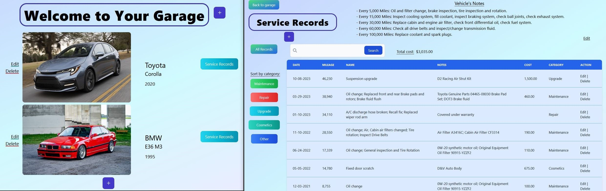

# Vehicle Service Tracker

The Vehicle Service Records Tracking application is a software solution designed to help vehicle owners and enthusiasts efficiently manage their car maintenance records and track their vehicle's history. 
This program eases the process of recording and managing maintenance activities, providing a digital garage for all your vehicle-related data.

## Features
#### Vehicle Management 
- Add/Edit/Delete Vehicles: Users can effortlessly add new vehicles to their digital garage, including details like make, model, year, and picture.
#### Records Management 
- Add/Edit/Delete Records: Users can add and make changes to each record, including details like date, mileage, notes, cost and category.
- Search and Sort: The records table offers search capabilities, allowing users to quickly find specific records by searching name and notes columns.
The records in the table can also be sorted based on five different categories.
- Vehicle Notes: Each vehicle service records page includes a section for editable notes, allowing users to add specific details or reminders related to the car, such as maintenance preferences and schedule.
## Built with 
- Asp.NET Core MVC | .NET 6
- SQL Server
- Tailwind CSS
